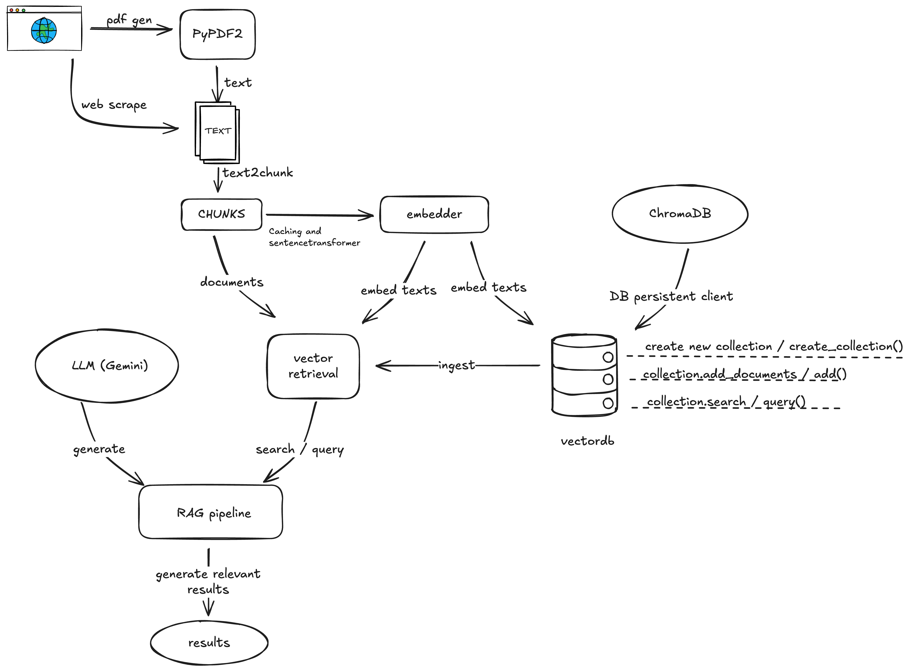

# RAG Simple

A simple Retrieval Augmented Generation (RAG) pipeline implementation.

## Architecture



## Features

- **Data Ingestion**: PDF parsing and web scraping
- **Vector Storage**: ChromaDB for persistent vector storage
- **Embeddings**: Sentence Transformers with caching
- **Retrieval**: Vector similarity search with reranking
- **Generation**: Gemini LLM integration

## Quick Start

```bash
pip install -r requirements.txt
python test_vector_rag.py
```

Requires `GOOGLE_API_KEY` in your environment.

